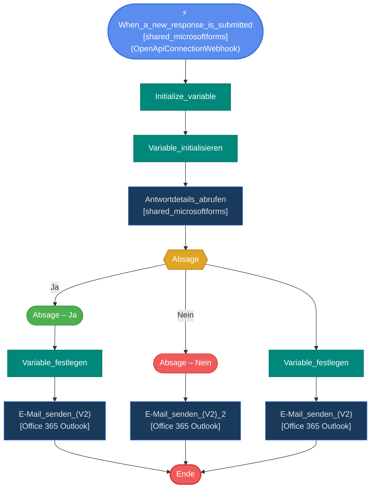

# Flussdiagramm

## Flow-Visualisierung

### Legende

| Farbe | Bedeutung |
|---|---|
| 🔵 Blau | Trigger / Standard-Aktion |
| 🟡 Gelb | Bedingung (If/Switch) |
| 🟣 Lila | Schleife (Foreach/Until) |
| 🟢 Gruen | Ja-Zweig / Case |
| 🔴 Rot | Nein-Zweig / Default / Ende |
| 🟤 Orange | HTTP-Aktionen |
| 🔷 Tuerkis | Variablen-Aktionen |
| ⬜ Grau | Daten-Operationen (Compose, ParseJson) |

