# Flussdiagramm

## Flow-Visualisierung

```mermaid
flowchart TD
    TRIGGER(["⚡ manual\n(Request)"])
    Compose_6928["Compose"]
    TRIGGER --> Compose_6928
    FLOW_END(["Ende"])
    Compose_6928 --> FLOW_END

    class TRIGGER trigger
    class Compose_6928 data
    class FLOW_END terminate

    %% Styles
    classDef trigger fill:#5B8DEF,stroke:#3A6FD8,color:#fff,stroke-width:2px
    classDef action fill:#1E2233,stroke:#5B8DEF,color:#E0E0E0,stroke-width:1px
    classDef connector fill:#1A3A5C,stroke:#5B8DEF,color:#E0E0E0,stroke-width:1px
    classDef condition fill:#E0A526,stroke:#C48F20,color:#fff,stroke-width:2px
    classDef loop fill:#9C27B0,stroke:#7B1FA2,color:#fff,stroke-width:2px
    classDef scope fill:#2E3B4E,stroke:#5B8DEF,color:#E0E0E0,stroke-width:1px,stroke-dasharray: 5 5
    classDef branch_true fill:#4CAF50,stroke:#388E3C,color:#fff,stroke-width:1px
    classDef branch_false fill:#EF5B5B,stroke:#D32F2F,color:#fff,stroke-width:1px
    classDef variable fill:#00897B,stroke:#00695C,color:#fff,stroke-width:1px
    classDef data fill:#546E7A,stroke:#37474F,color:#fff,stroke-width:1px
    classDef http fill:#FF7043,stroke:#E64A19,color:#fff,stroke-width:1px
    classDef terminate fill:#EF5B5B,stroke:#D32F2F,color:#fff,stroke-width:2px
```

### Legende

| Farbe | Bedeutung |
|---|---|
| 🔵 Blau | Trigger / Standard-Aktion |
| 🟡 Gelb | Bedingung (If/Switch) |
| 🟣 Lila | Schleife (Foreach/Until) |
| 🟢 Gruen | Ja-Zweig / Case |
| 🔴 Rot | Nein-Zweig / Default / Ende |
| 🟤 Orange | HTTP-Aktionen |
| 🔷 Tuerkis | Variablen-Aktionen |
| ⬜ Grau | Daten-Operationen (Compose, ParseJson) |

